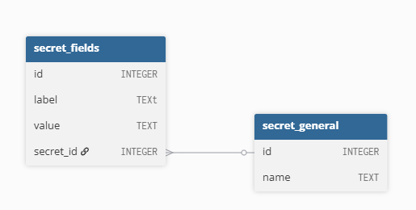

# Проект для хакатон OrenCode

### Система управления корпоративными секретами

## Проект разделён на 2 независимых модуля - бекенд часть, которая работает с базой данных и шифрованием и клиент-интерфейс

### Эти части связаны между собой через API, описанное в [википедии проекта](https://github.com/Nitor112221/SecretManager/wiki/API-between-client-and-local-web-server)

### Решения для обеспечения безопасности:

> хранение мастер пароля в хешированном виде
> 
> хранение в БД данных в зашифрованном виде с помощью ОРИГИНАЛЬНОГО мастер пароля
> 
> для шифрования и дешифрование используется новый мастер пароль, который введёт пользователь при условии, что хеш нового пароля совпадает с хешем основного пароля

### Системные требования
1. Операционная система Windows 10/11
2. Установленный Python 3.11 (на других работоспособность не гарантируем)
3. Система контроля версий git (для установки проекта, можно обойтись без неё установив файлы проект другим способом)

### Инструкция по установки и эксплуатации

## Установить проект
 ```bash
git clone https://github.com/Nitor112221/SecretManager.git
```
и перейдите в директорию проекта
## Создание виртуального окружения
### Инициализируем виртуальное окружение
```bash
python -m venv .venv
```
### Активируем виртуальное окружение
```bash
.venv/Scrtipts/activate
```

## Установить зависимости

### Если вы хотите запустить клиент через python, то выполните команду
```bash
pip install -r requirements/cliend.txt
```

### При любом варианте запуска выполните команду
```bash
pip install -r requirements/backend.txt
```

## Запуск
### Запускаем локальный веб сервер (отвечает за шифрование и базу данных)
```bash
cd backend
python main_backend.py
```
### По умолчанию бекенд запускается на порту 5678, этот порт можно изменить передав новый при запуске
```bash
cd backend
python main_backend.py 1234
```

### Запустить клиент можно разными способами
1. Запустить secretmanager.exe из папки exe_files
2. Запустить через другой терминал с помощью команды
```bash
python main.py
```
### (не забудьте поставить нужный порт в клиенте, который установили для локального веб сервера)

## Дополнительная информация

### [Архитектура проекта](https://miro.com/welcomeonboard/TzZUY2hNVE1KdnIvOURlWFpBRDVVSlJWVUV6R0dVOXJGNEhSWWsrc1o4cTRacmNJSnhjMkVQZ3U5Vll4Mk0wb01zMEluZ2dyMDJabEs3MlJab0dPSDI1YXlhRGtvSjg5TjhmVElLT2RLQXNySWlaZnNURnkwR0VMVTRHUGhUVXRnbHpza3F6REdEcmNpNEFOMmJXWXBBPT0hdjE=?share_link_id=238825892193)

### Схема базы данных
